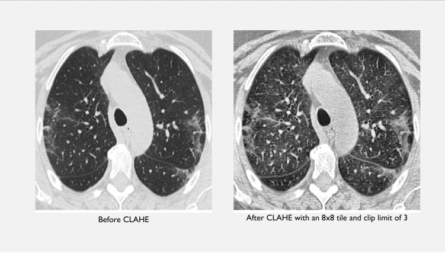
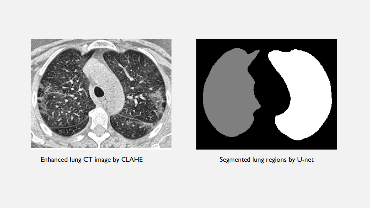
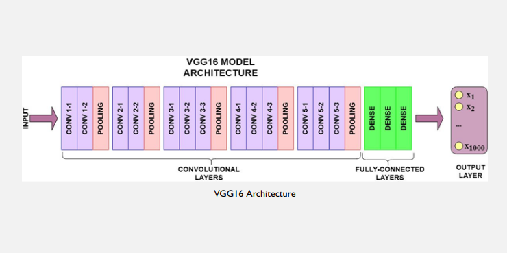
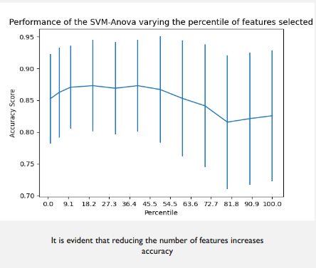
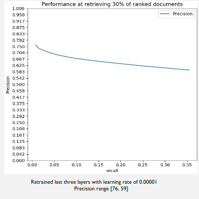

# Content-Based Image Retrieval for COVID-19 Lung CT Scans

**Author:** Farzad Rahim Khanian  
Università degli Studi di Milano  
[farzad.rahimkhanian@studenti.unimi.it](mailto:farzad.rahimkhanian@studenti.unimi.it)  
[farzad.u235@gmail.com](mailto:farzad.u235@gmail.com)

---

## Introduction

The COVID-19 pandemic, caused by the novel coronavirus SARS-CoV-2, has posed unprecedented challenges to global healthcare systems. Chest computed tomography (CT) has proven to be a vital tool in the diagnosis and monitoring of COVID-19 patients, often revealing characteristic lung abnormalities even in early stages of infection. In addition to clinical applications, the rapid sharing and analysis of medical images have become crucial for research, particularly for the development and validation of machine learning models capable of aiding diagnosis, prognosis, and resource allocation. Content-based image retrieval (CBIR) systems offer the possibility of efficiently finding visually similar cases from large databases, supporting both clinical decision-making and research workflows.

This project presents a CBIR framework tailored for COVID-19 lung CT images, incorporating state-of-the-art image processing, deep feature extraction, and machine learning techniques. The system is designed to facilitate rapid comparison of lung CT cases and to provide a reproducible pipeline for further research on COVID-19 imaging data.

---

## Dataset

The dataset used in this study comprises axial CT slices of the lungs, collected from confirmed COVID-19 cases and controls. The images were originally provided in DICOM format, ensuring high fidelity with respect to radiodensity measurements. For compatibility and efficiency in the image processing pipeline, all CT slices were converted to PNG format.  
The source of this dataset is Cohen et al., 2020[^cohen2020], a public repository widely used for research on COVID-19 imaging. The dataset contains annotated images, facilitating supervised learning and quantitative evaluation.

---

## Theoretical Background

- **Radiodensity and Hounsfield Units:**  
  CT image intensity is measured in Hounsfield Units (HU), providing a standard scale for tissue radiodensity[^hounsfield1973].

- **Image Enhancement (CLAHE):**  
  Medical CT images often suffer from low contrast. Contrast Limited Adaptive Histogram Equalization (CLAHE) is used to enhance details without amplifying noise.

- **Lung Segmentation (U-Net):**  
  Isolating the lung region is crucial to remove background and focus feature extraction. U-Net architecture is a leading CNN approach for biomedical segmentation[^ronneberger2015].  
  Implementation is provided via the [lungmask](https://github.com/JoHof/lungmask) tool[^lungmask2020].

- **Deep Feature Extraction (VGG16):**  
  VGG16 is a deep convolutional neural network (CNN) that captures high-level image features. The last dense layer is removed, and outputs from the final convolutional layer are used as feature vectors[^simonyan2014].

- **Other Architectures (ResNet):**  
  ResNet models, based on residual learning, are sometimes used in related COVID-19 CT tasks for their superior representation power[^he2016].

- **Feature Selection & Classification:**  
  Chi-squared feature selection and SVM are applied to optimize feature relevance and classification accuracy.

- **Content-Based Image Retrieval (CBIR):**  
  Given a query CT scan, the system retrieves similar images based on cosine similarity of deep features. Performance is measured using precision and recall metrics[^wang2020].

- **Frameworks and Tools:**  
  The deep learning pipeline is implemented with Keras, a high-level neural networks API[^chollet2015].

---

## Project Architecture and Code Structure

```
main.py                  # Main menu and entry point
image_processing.py      # Preprocessing, enhancement, segmentation routines
feature_extraction.py    # Deep feature extraction, fine-tuning, feature selection, retrieval
requirements.txt         # Python dependencies
/data/
  raw/COVID/             # Place raw COVID CT images here (.png)
  raw/non-COVID/         # Place raw non-COVID CT images here (.png)
  enhanced/              # Enhanced images after CLAHE
  mask/                  # Lung masks from segmentation
  masked/                # Images after enhancement & masking
  training/              # Training split
  test/                  # Test split
/figures/                # Add your images/plots here for documentation
```
## Code Structure and Terminal Menu

The project is organized for clarity and modularity, with clear separation between image preprocessing, feature extraction, and evaluation modules.

---

### Terminal Menu Details

Running `python main.py` presents an interactive menu with options for every major pipeline step.  
**Each option triggers a key part of the workflow as follows:**

| Option | Operation                                                        | What it Does                                                                                                    |
|--------|------------------------------------------------------------------|-----------------------------------------------------------------------------------------------------------------|
| **1**  | Image processing                                                 | Preprocesses images: applies CLAHE enhancement, performs lung segmentation (lungmask), applies masks, and splits data into training and test sets. |
| **2**  | Evaluate retrieval                                               | Extracts deep features (VGG16), performs image retrieval on test queries, and plots precision/recall curves.     |
| **3**  | Evaluate feature selection                                       | Evaluates which extracted features are most useful for SVM-based classification using ANOVA/chi2 selection.      |
| **4**  | Evaluate retrieval with feature selection                        | Runs image retrieval pipeline, but applies feature selection (chi2) to improve retrieval by reducing feature noise. |
| **5**  | Evaluate retrieval with feature selection and fine-tuning        | Fine-tunes VGG16 on your dataset, extracts features from the fine-tuned model, applies feature selection, and evaluates retrieval performance. |
| **6**  | Exit                                                            | Exits the program.                                                                                               |

**Note:**  
There is a numbering typo in the printed menu (two “5”s and no “4”), but the menu logic works as above:  
- Entering `4` executes *Evaluate retrieval with feature selection*  
- Entering `5` executes *Evaluate retrieval with feature selection and fine-tuning*  
- Any invalid input or option will prompt you to select again.

**In summary:**  
- **Option 1:** Preprocess and split your data  
- **Option 2:** Baseline image retrieval using VGG16 features  
- **Option 3:** Analyze and visualize best feature subset via SVM/chi2  
- **Option 4:** Retrieval using only selected features (reduces noise)  
- **Option 5:** Same as 4, but features come from a VGG16 fine-tuned on your data  
- **Option 6:** Exit

---

### Summary of Core Python Modules

#### `main.py`
- User interface: text-based menu for all major actions.
- Each menu option triggers a well-defined function.
- Exits gracefully on selection 6.

#### `feature_extraction.py`
- **Feature extraction**: VGG16/VGG19-based vectorization of images.
- **Feature selection**: chi2 (ANOVA) and SVM evaluation.
- **Fine-tuning**: Unfreezes top VGG16 layers, retrains on COVID data.
- **Retrieval**: Uses cosine similarity for ranking images.
- **Evaluation**: Precision/recall and SVM accuracy plots.

#### `image_processing.py`
- **Preprocessing**: Image resizing, CLAHE, etc.
- **Segmentation**: Automatic lung region isolation (lungmask/U-Net).
- **Splitting**: Generates consistent train/test folders for ML workflows.

---


## Installation and Requirements

**System Requirements:**
- Windows (for CUDA compatibility)
- NVIDIA GPU (recommended) with CUDA drivers
- Python 3.8+

**Python Dependencies:**
```sh
pip install -r requirements.txt
pip install lungmask
```
> See `requirements.txt` for versions.

---

## Data Preparation

1. Place your CT images in `.png` format under:
    - `./data/raw/COVID`
    - `./data/raw/non-COVID`
2. All further folders are created automatically by the pipeline.

---

## Pipeline Workflow

### 1. Image Enhancement

- Resizes images to 224x224 pixels.
- Applies CLAHE for improved local contrast.
- Output in `./data/enhanced`.

### 2. Lung Segmentation

- Uses [lungmask](https://github.com/JoHof/lungmask) (U-Net) for lung mask generation.
- Masks applied to focus on lung tissue.
- Output in `./data/masked`.

### 3. Data Splitting

- Automatically splits data into training (80%) and test (20%).
- Each split contains COVID and non-COVID subfolders.

### 4. Feature Extraction

- Loads each CT scan, normalizes, and passes through VGG16 (no top dense layer).
- Features saved as `.joblib` files.

### 5. Feature Selection

- Reduces dimensionality via chi-squared selection.
- Optionally trains an SVM classifier.

### 6. Fine-Tuning and Model Training

- Unfreezes last 3 blocks of VGG16 for training on COVID data.
- Adam optimizer, low learning rate, data augmentation, early stopping.

### 7. Retrieval and Evaluation

- Cosine similarity for image retrieval.
- Precision/recall at various top-k thresholds.
- Evaluation plots and SVM results.

---

## How to Run

1. **Navigate to the project directory.**
2. Start the pipeline:
   ```sh
   python main.py
   ```
3. Choose options from the menu for processing, evaluation, feature selection, or fine-tuning.
4. View results in the working directory.

---

## Example Results

Add your files in the `/figures` directory and reference them as shown:

- **Before/After Enhancement:**  
  
- **Segmentation Mask Example:**  
  
- **VGG16 Architecture Schematic:**  
  
- **SVM Feature Selection Performance:**  
  
- **Precision-Recall Curve:**  
  

---

## References

[^cohen2020]: Cohen, J. P., Morrison, P., Dao, L., Roth, K., Duong, T. Q., & Ghassemi, M. (2020). COVID-19 image data collection: Prospective predictions are the future. *arXiv preprint arXiv:2006.11988*.
[^wang2020]: Wang, S., Kang, B., Ma, J., Zeng, X., Xiao, M., Guo, J., ... & Xu, B. (2020). A deep learning algorithm using CT images to screen for Corona Virus Disease (COVID-19). *European Radiology*, 31(8), 6096–6104. [https://doi.org/10.1007/s00330-021-07715-1](https://doi.org/10.1007/s00330-021-07715-1)
[^hounsfield1973]: Hounsfield, G. N. (1973). Computerized transverse axial scanning (tomography): Part 1. Description of system. *The British Journal of Radiology*, 46(552), 1016–1022.
[^ronneberger2015]: Ronneberger, O., Fischer, P., & Brox, T. (2015). U-net: Convolutional networks for biomedical image segmentation. In *Medical image computing and computer-assisted intervention* (pp. 234–241). Springer. [https://doi.org/10.1007/978-3-319-24574-4_28](https://doi.org/10.1007/978-3-319-24574-4_28)
[^lungmask2020]: Hofmanninger, J., Prayer, F., Pan, J., Röhrich, S., Prosch, H., & Langs, G. (2020). Automatic lung segmentation in routine imaging is a data diversity problem, not a methodology problem. *European Radiology Experimental*, 4(1), 50. [lungmask GitHub](https://github.com/JoHof/lungmask)
[^simonyan2014]: Simonyan, K., & Zisserman, A. (2014). Very deep convolutional networks for large-scale image recognition. *arXiv preprint arXiv:1409.1556*.
[^chollet2015]: Chollet, F. et al. (2015). Keras. [https://keras.io](https://keras.io)
[^he2016]: He, K., Zhang, X., Ren, S., & Sun, J. (2016). Deep residual learning for image recognition. In *Proceedings of the IEEE conference on computer vision and pattern recognition* (pp. 770–778). [https://doi.org/10.1109/CVPR.2016.90](https://doi.org/10.1109/CVPR.2016.90)

---

## Acknowledgments

- [lungmask](https://github.com/JoHof/lungmask) for open-source lung segmentation.
- Keras/TensorFlow teams for accessible deep learning frameworks.
- Università degli Studi di Milano for support.

---

## License

See [LICENSE](LICENSE).

---
